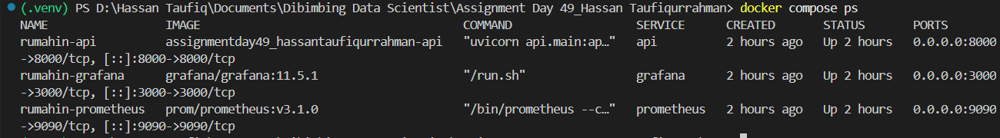
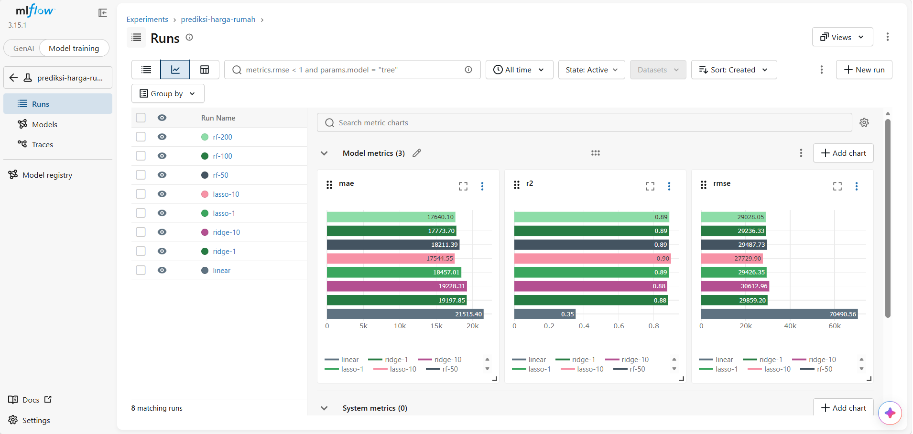
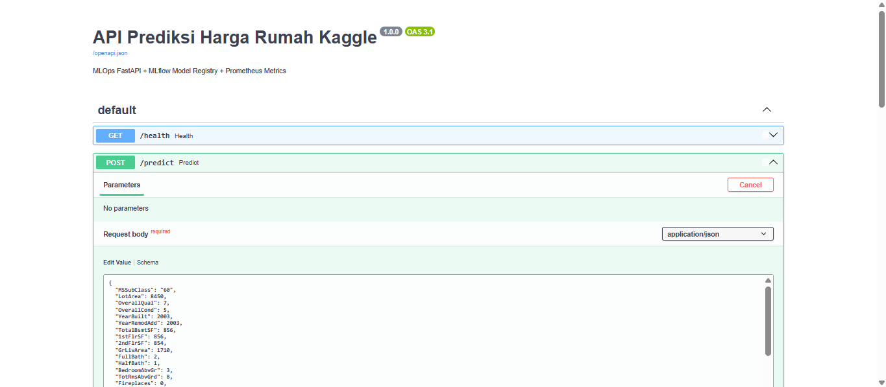
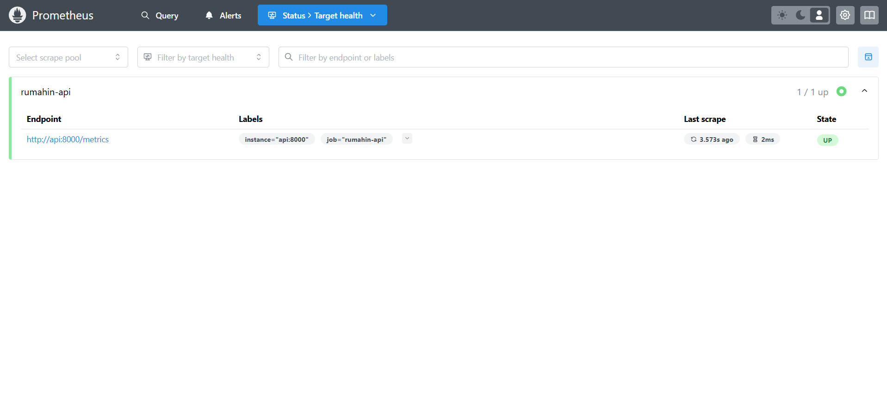
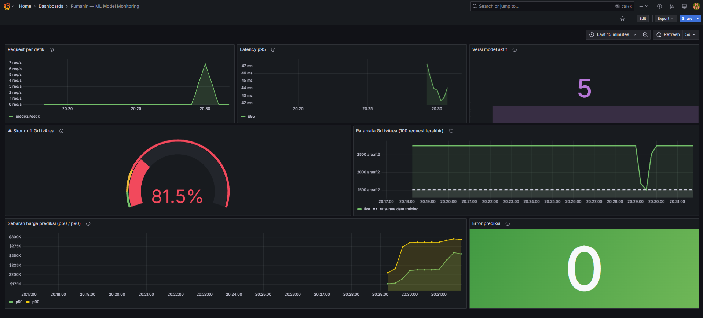

# Rumahin: House Price Prediction - End-to-End MLOps Pipeline

**Assignment Python-Powered MLOps: From Frameworks to Model Monitoring_Dibimbing DSML Batch 42_Hassan Taufiqurrahman**

Proyek ini merupakan implementasi pipeline MLOps end-to-end untuk memprediksi harga rumah yang mencakup model training, experiment tracking, penyajian model, hingga pemantauan performa model dan data drift secara real time. Dataset yang digunakan dalam proyek ini diambil dari [Kaggle - House Prices Advanced Regression Techniques](https://www.kaggle.com/c/house-prices-advanced-regression-techniques).

## Arsitektur

* **Modular Codebase:** Pemisahan kode yang rapi untuk preprocessing, training, dan prediksi di folder `src/` dan `api/`.
* **Experiment Tracking (MLflow):** Pencatatan otomatis untuk parameter model dan metrik evaluasi ($R^2$, MAE, RMSE).
* **REST API Serving (FastAPI):** Endpoint produksi yang dilengkapi validasi data input dan handling error.
* **System & Data Monitoring:** Integrasi Prometheus untuk pengumpulan metrik aplikasi serta Grafana untuk visualisasi throughput, latency, dan skor data drift.
* **Docker Containerization:** Seluruh stack MLOps dikemas menggunakan `docker-compose` agar mudah di-deploy di mana saja.

## Daftar Isi

| Komponen | Deskripsi | 
|---|---|
| `notebooks/house_prices_prediction.ipynb` | File Exploratory Data Analysis (EDA) dan eksperimen model awal |
| `src/config.py` | File penyimpanan seluruh konfigurasi global proyek secara terpusat | 
| `src/data.py` | File load data, data cleaning, pemisahan data menjadi data train dan test serta preprocessing awal | 
| `src/train.py` | File pelatihan model dan diintegrasikan pelacakan eksperimen MLflow | 
| `src/predict.py` | File fungsi prediksi yang memuat model dari alias `@champion` | 
| `src/rollback.py` | File pemulihan layanan kembali untuk memindahkan `@champion` ke versi sebelumnya | 
| `src/logger.py` | File sistem pencatatan log terstruktur (structured logging) | 
| `src/monitor.py` | File kalkulasi metrik monitoring, khususnya menghitung indikator data drift dan mengirimkan metrik tersebut ke Prometheus | 
| `api/main.py` | File penyajian model sebagai layanan web API berupa aplikasi FastAPI | 
| `monitoring/` | Berkas yang berisi konfigurasi untuk infrastruktur pemantauan | 
| `scripts/traffic.py` | File traffic generator untuk mensimulasikan request HTTP dari pengguna secara beruntun ke FastAPI | 
| `Dockerfile`, `docker-compose.yml` | File pembangunan container image dan orkestrator untuk menjalankan FastAPI, Prometheus, dan Grafana | 

## Service

* **MLflow:** `http://localhost:5001`

* **FastAPI:** `http://localhost:8000/docs`

* **Prometheus:** `http://localhost:9090`

* **Grafana:** `http://localhost:3000`

